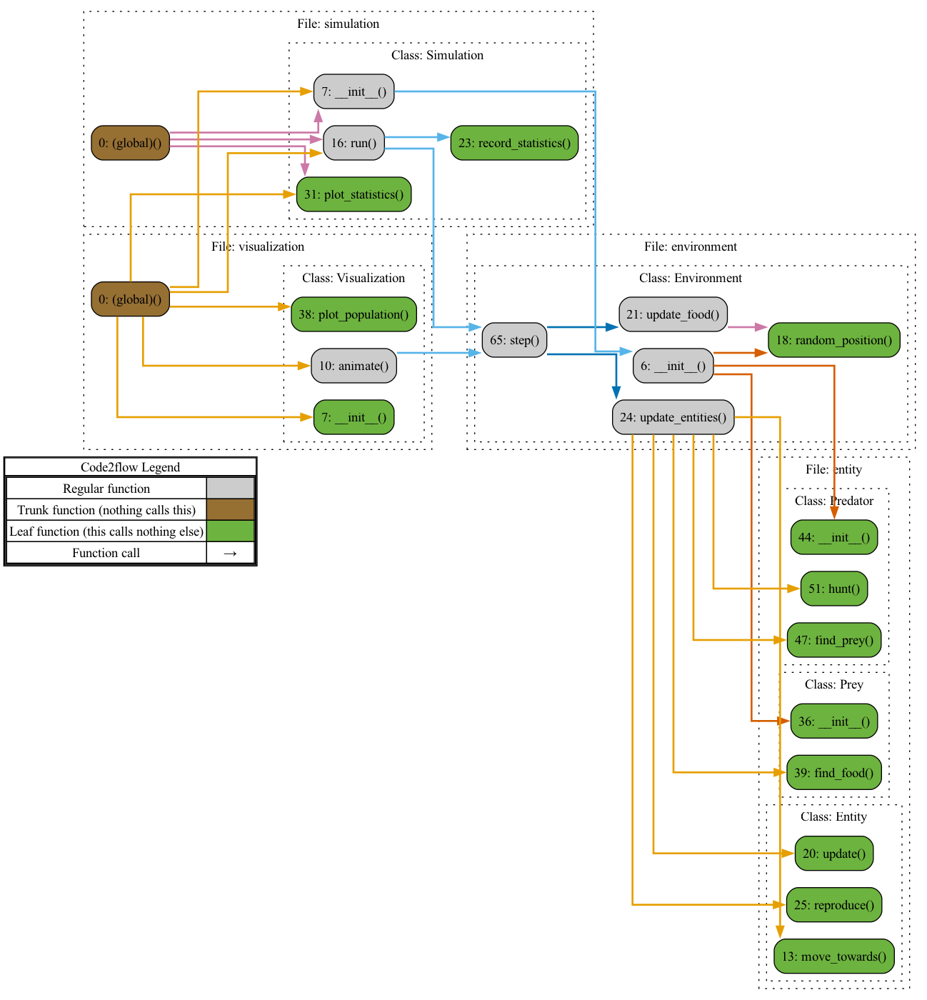
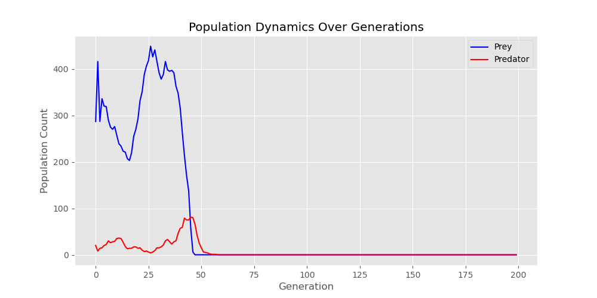
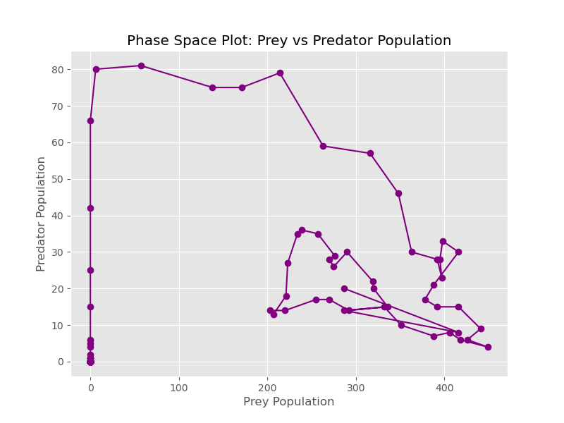
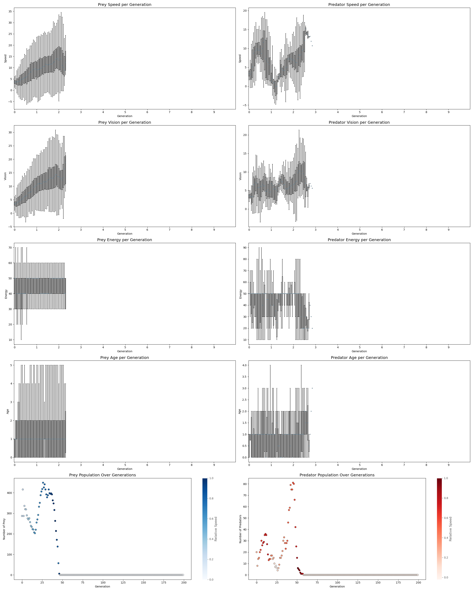

# 🧬 Coevolution Simulation: Predator-Prey Dynamics

This project simulates a coevolutionary system involving **predators** and **prey** that adapt over generations based on traits like **speed**, **vision**, **energy**, and **lifespan**. The simulation tracks evolution-driven population changes and visualizes key ecological metrics.

---

## 📁 Project Structure


```
.
├── entity.py              # Defines Entity, Prey, and Predator classes
├── environment.py         # Handles food, movement, hunting, and reproduction logic
├── simulation.py          # Runs the evolutionary simulation and plots stats
├── visualization.py       # Creates animations and plots
├── results/
│   ├── animation.mp4
│   ├── population_dynamics.png
│   ├── phase_space_plot.png
│   └── simulation_results.png
└── README.md              # You're reading it!
```

---

## 🧠 Core Concepts

- **Prey** seek food to gain energy and reproduce if their energy is high enough.
- **Predators** hunt prey to survive and reproduce.
- Over time, natural selection favors traits that increase survival and reproductive success.

---

## 📊 Visualizations

### 🎥 Animation: Entity Movement & Interaction


🎞️ Full video: [`results/animation.mp4`](results/animation.gif)

---

### 📈 Population Dynamics

Population changes across generations:



---

### 🔄 Phase Space Plot

Shows cyclical predator-prey population interaction:



---

### 📉 Evolutionary Statistics

Boxplots of evolutionary trait changes over time:



---

## 🧪 How It Works

### 1. `Entity` (in `entity.py`)
The base class for `Prey` and `Predator`. Tracks:
- Position, speed, vision
- Energy and age
- Lifespan-based decay of traits

### 2. `Environment` (in `environment.py`)
Simulates:
- Food generation and consumption
- Prey seeking food and reproducing
- Predators hunting prey and reproducing

### 3. `Simulation` (in `simulation.py`)
- Initializes the environment
- Steps through generations
- Records statistics (speed, vision, age, energy, population)

### 4. `Visualization` (in `visualization.py`)
- Animates spatial behavior
- Plots populations and trait evolution
- Saves all figures to the `results/` directory

---

## ▶️ Run the Simulation

```bash
python simulation.py
```

Or run the full animation and plotting:

```bash
python visualization.py
```

Ensure `ffmpeg` is installed if you want to save animations:
```bash
brew install ffmpeg  # macOS
```

---

## 📦 Requirements

- Python 3.7+
- `numpy`
- `matplotlib`

Install dependencies:
```bash
pip install -r requirements.txt
```

---

## 🧬 Example Output

```bash
Generation 1: Preys = 200, Predators = 10
Generation 2: Preys = 245, Predators = 12
...
```

---

## 🧠 Inspiration

This simulation is inspired by classic **Lotka-Volterra** predator-prey dynamics, extended with **evolving traits** that co-adapt over time.

---

## 📄 License

MIT License © 2025

---

## 🙌 Acknowledgments

Flowchart made with [Code2Flow](https://code2flow.com)  
Visualizations by [Matplotlib](https://matplotlib.org)

---
